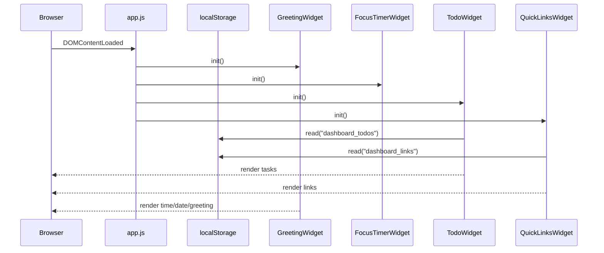

# Design Document: Personal Dashboard

## Overview

A single-page personal dashboard built with vanilla HTML, CSS, and JavaScript. All state is persisted in `localStorage`. No build step, no dependencies, no server — just static files deployable to GitHub Pages.

The app is structured as one HTML file (`index.html`), one stylesheet (`css/style.css`), and one JavaScript module (`js/app.js`). Each of the four widgets (Greeting, Focus Timer, To-Do List, Quick Links) is self-contained in its own logical section of `app.js`, communicating only through shared `localStorage` keys and DOM events.

---

## Architecture

The app follows a simple **widget module** pattern inside a single JS file. There is no framework, no virtual DOM, and no module bundler. Each widget is an IIFE-style object with `init()`, `render()`, and (where applicable) `persist()` methods.

```
index.html
├── css/
│   └── style.css
└── js/
    └── app.js
        ├── GreetingWidget
        ├── FocusTimerWidget
        ├── TodoWidget
        └── QuickLinksWidget
```

Startup sequence:



---

## Components and Interfaces

### GreetingWidget

Responsible for displaying the current time, date, and a time-based greeting. Updates the time display every 60 seconds via `setInterval`.

```
GreetingWidget
  init()          → starts interval, calls render()
  render()        → updates #greeting-time, #greeting-date, #greeting-message
  getGreeting(h)  → returns greeting string for hour h (0–23)
```

### FocusTimerWidget

Manages a 25-minute countdown. Uses `setInterval` for the tick. State is held in memory only (not persisted — timer resets on page reload by design).

```
FocusTimerWidget
  init()          → binds Start/Stop/Reset buttons
  start()         → begins interval if not already running
  stop()          → clears interval, retains remaining seconds
  reset()         → clears interval, restores to 1500 seconds
  tick()          → decrements remaining, calls render(), stops at 0
  render()        → updates #timer-display, toggles #timer-complete indicator
```

### TodoWidget

Manages the task list. Reads from and writes to `localStorage` on every mutation.

```
TodoWidget
  init()          → loads from storage, renders, binds add-form submit
  load()          → reads "dashboard_todos" from localStorage → Task[]
  persist()       → writes current task array to "dashboard_todos"
  addTask(label)  → validates, creates Task, persists, renders
  editTask(id)    → replaces label, persists, renders
  toggleTask(id)  → flips done flag, persists, renders
  deleteTask(id)  → removes by id, persists, renders
  render()        → rebuilds #todo-list DOM from task array
  validate(label) → returns error string or null
```

### QuickLinksWidget

Manages the link list. Reads from and writes to `localStorage` on every mutation.

```
QuickLinksWidget
  init()          → loads from storage, renders, binds add-form submit
  load()          → reads "dashboard_links" from localStorage → Link[]
  persist()       → writes current link array to "dashboard_links"
  addLink(label, url) → validates, creates Link, persists, renders
  deleteLink(id)  → removes by id, persists, renders
  render()        → rebuilds #links-panel DOM from link array
  validate(label, url) → returns error string or null
```

---

## Data Models

### Task

```js
{
  id:    string,   // crypto.randomUUID() or Date.now().toString()
  label: string,   // non-empty, trimmed
  done:  boolean   // false on creation
}
```

Stored as a JSON array under the key `"dashboard_todos"` in `localStorage`.

### Link

```js
{
  id:    string,   // crypto.randomUUID() or Date.now().toString()
  label: string,   // non-empty, trimmed
  url:   string    // must start with "http://" or "https://"
}
```

Stored as a JSON array under the key `"dashboard_links"` in `localStorage`.

### localStorage Schema

| Key                | Value type | Description                  |
|--------------------|------------|------------------------------|
| `dashboard_todos`  | JSON string | Serialised `Task[]`          |
| `dashboard_links`  | JSON string | Serialised `Link[]`          |

---

## Correctness Properties

*A property is a characteristic or behavior that should hold true across all valid executions of a system — essentially, a formal statement about what the system should do. Properties serve as the bridge between human-readable specifications and machine-verifiable correctness guarantees.*


### Property 1: Greeting covers all hours

*For any* hour value h in [0, 23], `getGreeting(h)` should return exactly one of "Good morning", "Good afternoon", "Good evening", or "Good night", with the correct string determined by the range h falls into: [5,11] → morning, [12,17] → afternoon, [18,21] → evening, [22,23] ∪ [0,4] → night.

**Validates: Requirements 1.3, 1.4, 1.5, 1.6**

### Property 2: Time format is HH:MM

*For any* Date object, the time-formatting function should produce a string matching the pattern `HH:MM` (two-digit hour, colon, two-digit minute).

**Validates: Requirements 1.1**

### Property 3: Date format contains required components

*For any* Date object, the date-formatting function should produce a string that contains a full weekday name, a full month name, a numeric day, and a four-digit year.

**Validates: Requirements 1.2**

### Property 4: Timer tick decrements remaining by exactly 1

*For any* timer state where remaining > 0, calling `tick()` once should decrease `remaining` by exactly 1.

**Validates: Requirements 2.2**

### Property 5: Timer display format is MM:SS

*For any* integer seconds value in [0, 1500], the timer format function should produce a string matching the pattern `MM:SS` (two-digit minutes, colon, two-digit seconds).

**Validates: Requirements 2.3**

### Property 6: Stop retains remaining value

*For any* timer state with a given `remaining` value, calling `stop()` should leave `remaining` unchanged.

**Validates: Requirements 2.4**

### Property 7: Reset always restores to 1500

*For any* timer state (running, stopped, or at zero), calling `reset()` should set `remaining` to exactly 1500.

**Validates: Requirements 2.5**

### Property 8: Start is idempotent

*For any* timer state, calling `start()` when the timer is already running should not create an additional interval — the tick rate should remain one decrement per second.

**Validates: Requirements 2.7**

### Property 9: Adding a valid task grows the list

*For any* task array and any non-empty, non-whitespace string label, calling `addTask(label)` should increase the task array length by exactly 1 and the new task should appear in the array with the given label and `done: false`.

**Validates: Requirements 3.1**

### Property 10: Whitespace and empty labels are rejected

*For any* string composed entirely of whitespace characters (including the empty string), `validate(label)` should return a non-null error string and the task array should remain unchanged.

**Validates: Requirements 3.2**

### Property 11: Edit updates the task label

*For any* task in the list and any valid new label string, calling `editTask(id, newLabel)` should result in that task's `label` equalling `newLabel` while all other task fields remain unchanged.

**Validates: Requirements 3.3**

### Property 12: Toggle is its own inverse

*For any* task, calling `toggleTask(id)` twice in succession should return the task's `done` field to its original value.

**Validates: Requirements 3.4**

### Property 13: Delete removes the task

*For any* task array containing a task with a given id, calling `deleteTask(id)` should result in no task with that id remaining in the array.

**Validates: Requirements 3.5**

### Property 14: Todo persistence round-trip

*For any* array of Task objects (including the empty array), serialising it to `localStorage` via `persist()` and then deserialising it via `load()` should produce an array that is deeply equal to the original.

**Validates: Requirements 3.6, 3.7, 3.8**

### Property 15: Adding a valid link grows the list

*For any* link array and any valid label + http(s) URL pair, calling `addLink(label, url)` should increase the link array length by exactly 1 and the new link should appear with the given label and url.

**Validates: Requirements 4.1**

### Property 16: Link validation rejects invalid input

*For any* combination of label and URL where either the label is empty/whitespace, the URL is empty/whitespace, or the URL does not begin with "http://" or "https://", `validate(label, url)` should return a non-null error string and the link array should remain unchanged.

**Validates: Requirements 4.2, 4.3**

### Property 17: Delete removes the link

*For any* link array containing a link with a given id, calling `deleteLink(id)` should result in no link with that id remaining in the array.

**Validates: Requirements 4.5**

### Property 18: Links persistence round-trip

*For any* array of Link objects (including the empty array), serialising it to `localStorage` via `persist()` and then deserialising it via `load()` should produce an array that is deeply equal to the original.

**Validates: Requirements 4.6, 4.7, 4.8**

---

## Error Handling

**localStorage unavailable**: Wrap all `localStorage` reads/writes in try/catch. If storage is unavailable (e.g., private browsing with storage blocked), the widgets degrade gracefully — tasks and links are not persisted but the UI still functions for the session.

**Corrupt localStorage data**: If `JSON.parse` throws on a stored value, treat it as if the key were absent and start with an empty array. Log a `console.warn` for debuggability.

**Invalid task/link input**: Validation errors are shown as inline messages adjacent to the relevant form field. The error message is cleared on the next valid submission or when the input changes.

**Timer edge cases**: The timer cannot go below 0. The `tick()` function checks `remaining > 0` before decrementing; at 0 it clears the interval and shows the completion indicator.

**Missing DOM elements**: Each widget's `init()` checks for its required DOM nodes. If a node is absent (e.g., partial HTML), the widget logs a `console.error` and returns early rather than throwing.

---

## Testing Strategy

### Dual Testing Approach

Both unit tests and property-based tests are required. They are complementary:

- **Unit tests** cover specific examples, integration points, and edge cases (e.g., timer reaching 00:00, localStorage absent, corrupt data).
- **Property-based tests** verify universal correctness across randomised inputs (e.g., all hours for greeting, all valid/invalid labels for validation).

### Property-Based Testing

**Library**: [fast-check](https://github.com/dubzzz/fast-check) (JavaScript, works in Node without a bundler via `npm test`).

Each property-based test must run a minimum of **100 iterations**.

Each test must include a comment referencing the design property it validates:

```js
// Feature: personal-dashboard, Property 1: getGreeting covers all hours
fc.assert(fc.property(fc.integer({ min: 0, max: 23 }), (h) => {
  const result = getGreeting(h);
  return ["Good morning","Good afternoon","Good evening","Good night"].includes(result);
}), { numRuns: 100 });
```

Tag format: `Feature: personal-dashboard, Property {N}: {property_text}`

### Unit Testing

**Library**: [Vitest](https://vitest.dev/) (zero-config, runs in Node, no browser required for pure logic tests).

Unit tests should cover:
- Timer reaching exactly 00:00 and stopping (Requirement 2.6)
- Link button opening a new tab (Requirement 4.4) — mock `window.open`
- localStorage unavailable scenario (graceful degradation)
- Corrupt localStorage data (graceful degradation)
- Dashboard init with no stored data (Requirements 3.8, 4.8)

### Test File Structure

```
tests/
├── greeting.test.js       # Properties 1–3
├── timer.test.js          # Properties 4–8, unit tests for 2.6
├── todo.test.js           # Properties 9–14, unit tests for edge cases
└── quicklinks.test.js     # Properties 15–18, unit tests for 4.4
```

Pure logic functions (formatters, validators, state mutators) are extracted from widget objects so they can be imported and tested in Node without a DOM. DOM-dependent behaviour (render, init) is covered by integration/unit tests using jsdom or manual browser testing.
